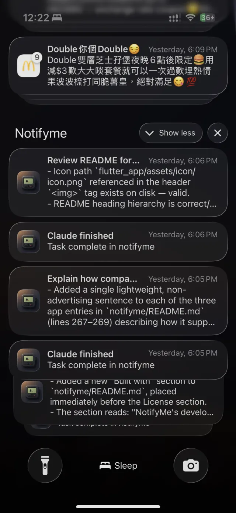
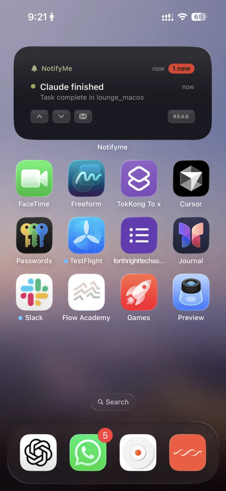
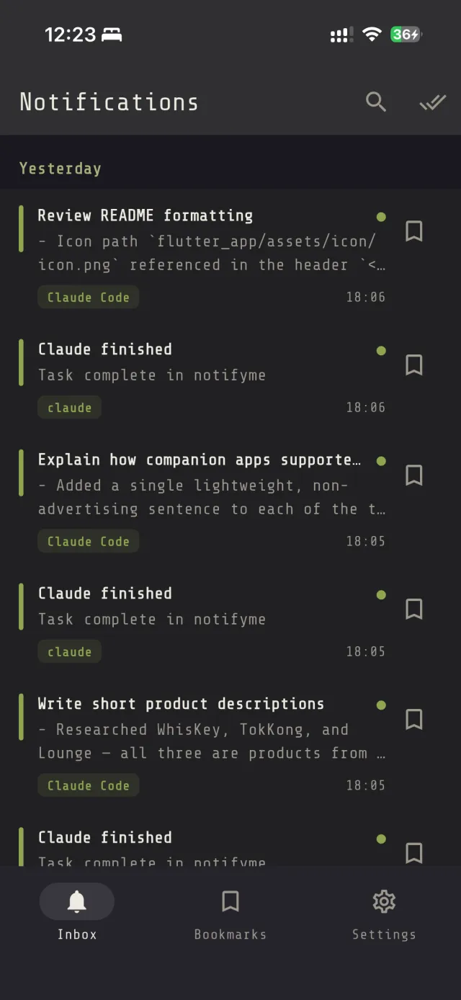
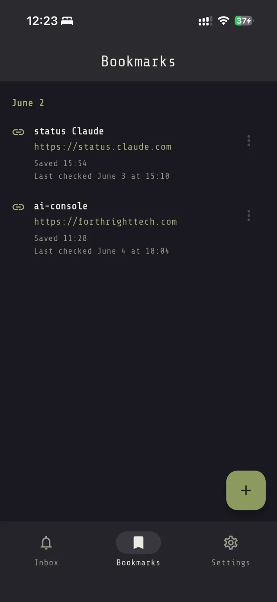
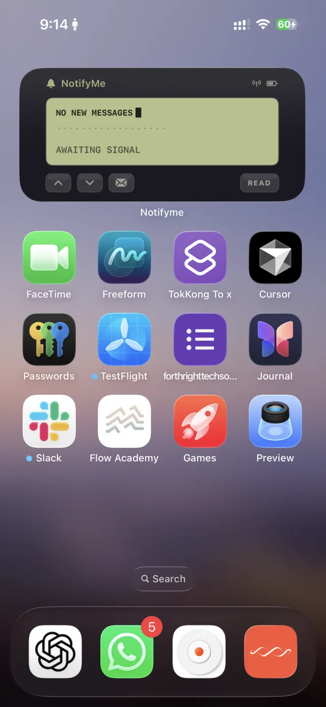
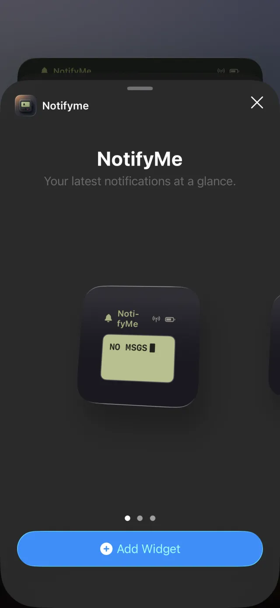
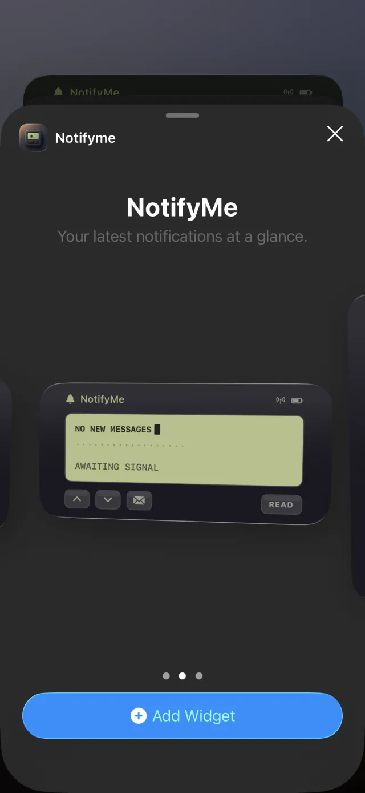
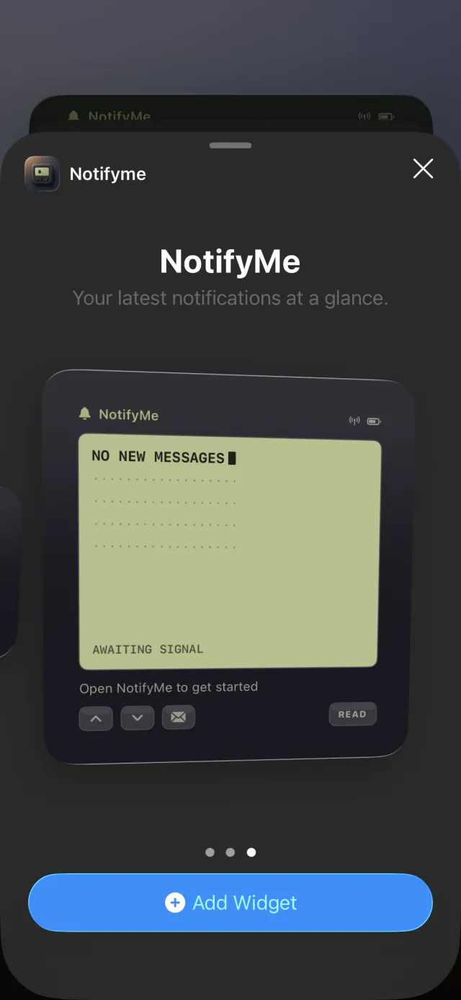

# NotifyMe

<p align="center">
  <a href="https://notifyme.asktobuild.app/">
    
  </a>
</p>

A self-hosted alternative to Pushover / ntfy / Bark. NotifyMe gives every
developer a personal webhook URL that pushes notifications straight to their
phone. Visit the [NotifyMe landing page](https://notifyme.asktobuild.app/) for
a quick visual overview of the project.

The driving use case is **monitoring long-running developer and AI-agent jobs**
— Claude Code, Codex CLI, n8n, GitHub Actions, CI pipelines, crawlers. The flow
is dead simple:

```
POST webhook → phone notification → open app → view details
```

You deploy the entire open-source stack into **your own Firebase project**.
There is no central server, no hardcoded project IDs, and no third party in the
path — your notifications stay yours.

## Screenshots

<table>
  <tr>
    <td align="center" width="25%"><br /><sub>Lock-screen stack</sub></td>
    <td align="center" width="25%"><br /><sub>Banner notification</sub></td>
    <td align="center" width="25%"><br /><sub>Notification inbox</sub></td>
    <td align="center" width="25%"><br /><sub>Bookmarks</sub></td>
  </tr>
  <tr>
    <td align="center" width="25%"><br /><sub>Home-screen widget</sub></td>
    <td align="center" width="25%"><br /><sub>Widget — small</sub></td>
    <td align="center" width="25%"><br /><sub>Widget — medium</sub></td>
    <td align="center" width="25%"><br /><sub>Widget — large</sub></td>
  </tr>
</table>

## Built with

NotifyMe's development was assisted by these tools:

- **[WhisKey](https://whiskey.asktobuild.app/)** — used for quick on-device dictation of notes, commit messages, and issue descriptions.
- **[TokKong](https://apps.apple.com/us/app/tokkong-local-ai/id6742748996)** — used for offline transcription and translation of reference material during development.
- **[Lounge](https://lounge.asktobuild.app/)** — surfaced long-running build and agent jobs on the desktop, which informed NotifyMe's own notification flow.

## MVP scope

The MVP delivers the end-to-end path from a webhook to a notification on your
phone:

- **Personal webhook URL** — `POST /webhook/{userToken}` accepts a notification
  payload and routes it to your device.
- **Push delivery** — notifications arrive via Firebase Cloud Messaging (FCM).
- **Notification inbox** — grouped by day, with categories and status colors
  (green = success, red = error, yellow = warning, blue = info).
- **Search** across your notifications.
- **Read state** — mark a notification read, or mark all read.
- **Tappable notifications** — an optional `url` opens the relevant PR, session,
  or dashboard.

Out of scope for the MVP (planned for v2): notification rules and priority,
`Authorization: Bearer` webhook secret verification, multiple projects, and team
sharing (one webhook fanning out to many recipients).

## Architecture

NotifyMe is a Flutter client backed entirely by Firebase. The end-to-end flow is
the core of the product:

```
external system
  → Cloud Function (POST /webhook/{userToken})
    → Firestore (notifications)
      → FCM push
        → phone
          → open app
            → notification detail
```

Three pieces and how they connect:

- **Cloud Functions** (`firebase_functions/`) — the only externally-reachable
  surface. The function resolves `userToken` to a `uid`, writes a notification
  document to Firestore, looks up that user's device FCM tokens, and sends the
  push via FCM.
- **Firestore** — three top-level collections, all keyed by `uid`:
  - `users` — `uid`, `email`, `createdAt`
  - `devices` — `uid`, `fcmToken`, `platform`
  - `notifications` — `uid`, `title`, `message`, `category`, `status`, `read`,
    `createdAt`

  Security rules scope every read and write to the authenticated user's own
  `uid`.
- **Flutter app** (`flutter_app/`) — uses Firebase Auth (sign-in), Firestore
  (inbox / search / read state), Firebase Messaging (registers the device FCM
  token into `devices` and receives pushes), and Analytics. On iOS it also ships
  a **WidgetKit widget** that mirrors the latest notifications: Home Screen
  (small / medium / large) and, on **iOS 16+**, the **Lock Screen** and StandBy
  (inline / circular / rectangular accessory families). The widget reads a shared
  App Group snapshot — it never touches the network. See
  [`flutter_app/ios/WIDGET_SETUP.md`](flutter_app/ios/WIDGET_SETUP.md) for the
  App Group wiring and verification steps.

### Webhook payload contract

This contract is shared across the Cloud Function, the Flutter app, and the
examples. Keep all three in sync when it changes.

```json
{ "title": "...", "message": "...", "category": "claude", "status": "success", "url": "https://..." }
```

- `title` + `message` — the notification body.
- `status` — maps to a color (`success`, `error`, `warning`, `info`).
- `category` — organizes the inbox.
- `url` — optional; makes the notification tappable to open a PR, session, or
  dashboard.

### Supported payload formats

The webhook accepts two payload shapes on the same URL — no configuration or
separate endpoint needed:

- **Native JSON** — the flat contract above. Use this for your own scripts and
  the senders in [`examples/`](examples/).
- **Atlassian Statuspage** — the nested webhook format emitted by
  [Statuspage](https://www.atlassian.com/software/statuspage)-powered status
  pages, such as Claude's [status.claude.com](https://status.claude.com). The
  function detects these (incident and component-update events), normalizes them
  into the native contract — mapping incident/component severity to a status
  color and pulling through the incident title, latest update, and shortlink —
  then runs the same validate → persist → push flow. Detection is conservative,
  so native senders are never affected. See
  [`firebase_functions/README.md`](firebase_functions/README.md#atlassian-statuspage-payloads-srcstatuspagets)
  for the exact mapping.

#### Subscribe to Claude status updates

To get Claude service incidents pushed to your phone:

1. Open [status.claude.com](https://status.claude.com).
2. Click **Subscribe to updates**.
3. Choose the **Webhook** option (the **{ }** / webhook icon).
4. Paste your NotifyMe webhook URL
   (`https://<your-region>-<your-project>.cloudfunctions.net/webhook/<userToken>`).
5. Enter an email address — Statuspage uses it to notify you if webhook delivery
   fails — and confirm the subscription.

New Claude incidents and component status changes now arrive as NotifyMe
notifications, color-coded by severity. The same steps work for any other
Statuspage-powered status page.

## Repository layout

```
notifyme/
├── flutter_app/          # Flutter iOS/Android client
├── firebase_functions/   # Cloud Functions (webhook receiver + FCM sender)
├── docs/
└── examples/             # Copy-paste webhook senders:
    ├── claude-code/
    ├── codex-cli/
    ├── n8n/
    ├── github-actions/
    └── bash/
```

The `examples/` are a first-class deliverable — they're the project's adoption
path. Any change to the payload contract must be reflected in their `curl`
snippets.

## Quick start

NotifyMe runs in your own Firebase project. See
[`docs/FIREBASE_SETUP.md`](docs/FIREBASE_SETUP.md) for the complete first-time
setup guide.

The important folder rule is:

- Run **Firebase project commands** from the repository root: `notifyme/`.
- Run **Flutter app commands** from `notifyme/flutter_app/`.
- Run **Cloud Functions dependency/build/test commands** from
  `notifyme/firebase_functions/`.

### 1. Configure Firebase from the repository root

Use the repository root for Firebase CLI commands because it contains
`firebase.json`, `firestore.rules`, `firestore.indexes.json`, and the
`firebase_functions/` source folder.

```bash
cd /path/to/notifyme
firebase login
firebase use <your-firebase-project-id>

# First-time project initialization, if you have not already created firebase.json.
firebase init

# Deploy Firestore rules, indexes, and Cloud Functions.
firebase deploy
```

If this repository already contains `firebase.json`, you usually do not need to
run `firebase init` again. Select the project with `firebase use
<your-firebase-project-id>` and deploy from the repository root.

> **Enable the required APIs before your first Functions deploy.** The
> Cloud Functions deploy needs the **Cloud Functions**, **Cloud Build**,
> **Artifact Registry**, **Cloud Run**, and **Service Usage** APIs. The CLI
> tries to enable them automatically on first deploy, but that step fails — often
> with `Error: Failed to make request to
> https://serviceusage.googleapis.com/...` — if you are behind a **VPN or
> corporate proxy** that intercepts Google API traffic. The reliable fix is to
> enable them yourself once in the [Google Cloud
> Console](https://console.cloud.google.com/apis/library) (select your project,
> search each API, click **Enable**), then re-run `firebase deploy`. With
> `gcloud` installed you can do it in one command:
>
> ```bash
> gcloud config set project <your-firebase-project-id>
> gcloud services enable \
>   cloudfunctions.googleapis.com cloudbuild.googleapis.com \
>   artifactregistry.googleapis.com run.googleapis.com \
>   serviceusage.googleapis.com
> ```
>
> **Also grant the build service account permission** before your first deploy.
> Gen-2 functions build via Cloud Build running as your project's default compute
> service account (`<PROJECT_NUMBER>-compute@developer.gserviceaccount.com`), which
> on projects created after GCP's 2024 change no longer has the role it needs — so
> the first deploy fails with *"Could not build the function due to a missing
> permission on the build service account."* Grant it once:
>
> ```bash
> gcloud projects add-iam-policy-binding <your-firebase-project-id> \
>   --member="serviceAccount:<PROJECT_NUMBER>-compute@developer.gserviceaccount.com" \
>   --role="roles/cloudbuild.builds.builder" --condition=None
> ```
>
> (Find `<PROJECT_NUMBER>` in Console → Project settings → "Project number", or
> via `gcloud projects describe`. In the Console: IAM → that account → add the
> **Cloud Build Service Account** role.)
>
> See [`docs/DEPLOYMENT.md`](docs/DEPLOYMENT.md#troubleshooting) for the full
> troubleshooting table.

### 2. Configure the Flutter app from `flutter_app/`

FlutterFire writes Firebase app configuration into the Flutter project, so run
it from `flutter_app/`.

```bash
cd /path/to/notifyme/flutter_app
flutter pub get
flutterfire configure --project=<your-firebase-project-id>
flutter run
```

This generates the local Firebase options file for your own Firebase project.
Do not commit real Firebase credentials or generated local config files.

### 3. Work on Cloud Functions from `firebase_functions/`

Use `firebase_functions/` for Node dependency installation, TypeScript builds,
linting, and tests.

```bash
cd /path/to/notifyme/firebase_functions
npm install
npm run build
npm test
```

Deploying still happens from the repository root with `firebase deploy`, because
the Firebase CLI reads the root `firebase.json`.

### 4. Send a notification

After the backend is deployed and the app has signed in/registers a device,
send a notification from any tool using the payload contract above. The
`examples/` folder contains copy-paste senders for Claude Code, Codex CLI, n8n,
GitHub Actions, and plain `curl`.

A minimal send looks like:

```bash
curl -X POST "https://<your-region>-<your-project>.cloudfunctions.net/webhook/<userToken>" \
  -H "Content-Type: application/json" \
  -d '{ "title": "Build finished", "message": "All tests passed", "category": "ci", "status": "success", "url": "https://github.com/you/repo/actions" }'
```

## License

MIT — see [LICENSE](LICENSE).
